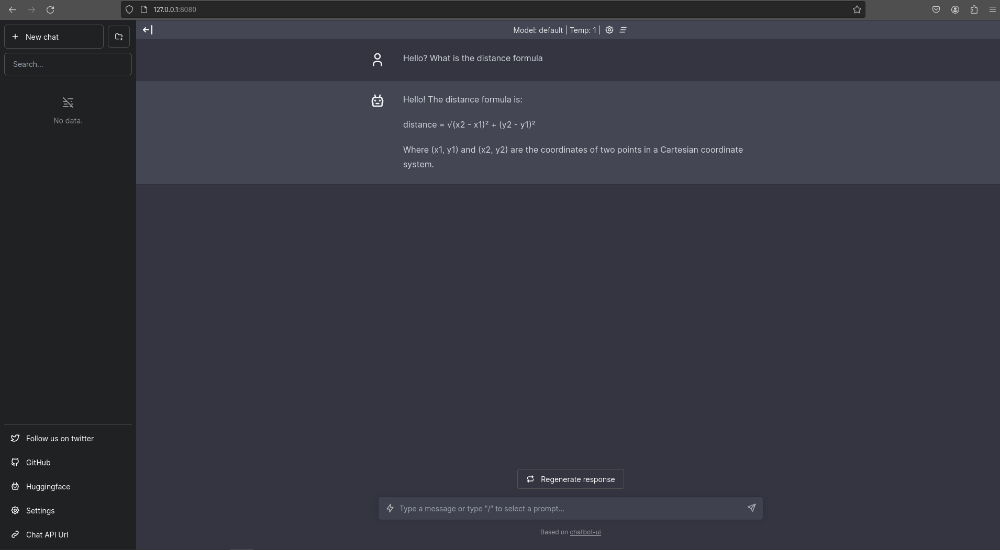
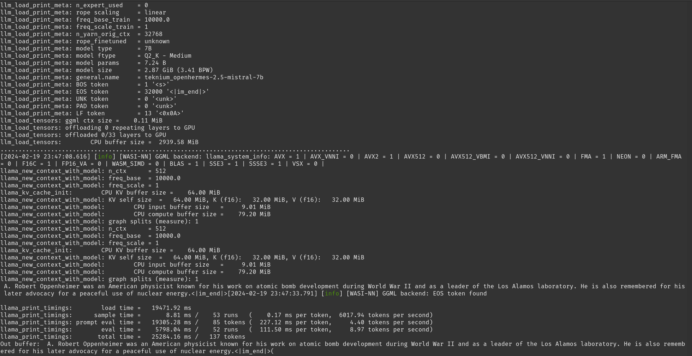

# LFX WasmEdge Pre-test

Applied for issue: [#3170(Integrate Whisper.cpp as a new WASI-NN backend)](https://github.com/WasmEdge/WasmEdge/issues/3170)

### About
The pre-test required me to build Whisper.cpp and WasmEdge frameworks. I have detailed the overall build process below.

### Table of Content

[Section 0 - Setting up Build Environment](#section-0---setting-up-build-environment)

- [Overview](#overview)
- [Environment](#environment)
- [Getting required tools/libs](#getting-the-required-tools--libs)

[Section 1 - Whisper.cpp](#section-1---whispercpp)

- [Overview](#overview-1)
- [Building Steps](#building-steps)
- [Running Whisper.cpp](#running-whispercpp-with-sample-audio)

[Section 2 - WasmEdge](#section-2---wasmedge)

- [Overview](#overview-2)
- [Building Steps](#building-steps-1)
- [Running API Server](#running-an-openai-compatible-api-server)
- [Testing the API Server](#testing-the-api-server)
- [Bonus - Running the frontend](#bonus---running-a-web-ui-for-the-api-server)

*[Section 3 - Building and running a simple cpp example](#section-3---building-and-running-a-cpp-wasi-nn-plugin-example)*

- [Overview](#overview-3)
- [Building Steps](#building-steps-2)
- [Running the example](#running-the-example)

---
## Section 0 - Setting up build environment

### Overview 

This section lists the steps I took to install various libs/tools required in the process as well as details about my environment.

#### Environment


I'm running Pop!_OS which comes with `apt` package manager.

#### Getting the required tools / libs

> [NOTE] This list only mentions libs which I did not had previously and needed to install.

LLVM:

```bash
wget https://apt.llvm.org/llvm.sh
chmod +x llvm.sh
sudo ./llvm.sh 18 all
```

OpenBLAS

```bash
sudo apt install libopenblas-dev
```

SIMDJson

```bash
sudo apt install libsimdjson-dev libsimdjson9
```

---
## Section 1 - Whisper.cpp

### Overview

Building whisper.cpp was relatively quick, I simply followed the [Quick Start](https://github.com/ggerganov/whisper.cpp) instructions mentioned in the project README.

### Building Steps
First we clone the repo using git and open it:
```bash 
git clone https://github.com/ggerganov/whisper.cpp.git && cd whisper.cpp
```

Next, get the base whisper model:
```bash
./models/download-ggml-model.sh base.en
```


Now run `make` to build the main example
```bash
make -j4
```


### Running Whisper.cpp with sample audio

We can now transcribe the audio file given in examples using the following command:

```bash
./main -m ./models/ggml-base.en.bin -f samples/jfk.wav
```


We can see that it correctly transcribed the sample audio!

---
## Section 2 - WasmEdge

### Overview
Building process for WasmEdge was relatively simple as well. I followed the [instructions](https://wasmedge.org/docs/contribute/source/plugin/wasi_nn/#build-wasmedge-with-wasi-nn-llamacpp-backend) given in WasmEdge docs. *I should note that I built WasmEdge with WASI-NN llama.cpp backend and with OpenBLAS Support.* 
**I *did* face issues while building the project due to simdjson linking problems but I was able to over come that by installing libsimdjson from apt.**
After building WasmEdge , we'll run the OpenAI compatible API Server from [this](https://github.com/second-state/LlamaEdge/tree/main/api-server) page.


### Building Steps

We'll first clone the git repo and open it:
```bash
git clone https://github.com/WasmEdge/WasmEdge.git && cd WasmEdge
```

Then, we will switch to `hydai/0.13.5_ggml_lts` branch:
```bash
git checkout hydai/0.13.5_ggml_lts
```

Now, we'll use cmake to build WasmEdge:
```bash
CC="clang-18" CXX="clang++-18" cmake -GNinja -Bbuild -DCMAKE_BUILD_TYPE=Release -DWASMEDGE_PLUGIN_WASI_NN_BACKEND="GGML" -DWASMEDGE_PLUGIN_WASI_NN_GGML_LLAMA_BLAS=ON
cmake --build build --parallel 10
```


Finally, we need to install the libs:
```bash
sudo cmake --install build
```


### Running an OpenAI compatible API Server

First switch to a test folder
```bash
cd .. && mkdir test && cd test
```

Download the model (Llama-2-7B). *This might take some time*
```bash
curl -LO https://huggingface.co/second-state/Llama-2-7B-Chat-GGUF/resolve/main/Llama-2-7b-chat-hf-Q5_K_M.gguf
```

Next, we'll download and run the api server app using WasmEdge:
```bash
curl -LO https://github.com/second-state/LlamaEdge/releases/latest/download/llama-api-server.wasm

wasmedge --dir .:. --nn-preload default:GGML:AUTO:Llama-2-7b-chat-hf-Q5_K_M.gguf llama-api-server.wasm -p llama-2-chat
```


### Testing the API Server

Various endpoints are provided by the API server, which can be used with curl to test the API server.

List Models
```bash
curl -X POST http://localhost:8080/v1/models -H 'accept:application/json'
```


Chat completions
```bash
curl -X POST http://localhost:8080/v1/chat/completions -H 'accept:application/json' -H 'Content-Type: application/json' -d '{"messages":[{"role":"system", "content": "You are a helpful assistant."}, {"role":"user", "content": "Who is Robert Oppenheimer?"}], "model":"llama-2-chat"}'
```


### Bonus - Running a Web UI for the API Server

Download the UI
```bash
curl -LO https://github.com/second-state/chatbot-ui/releases/latest/download/chatbot-ui.tar.gz
tar xzf chatbot-ui.tar.gz
```

Start the API server
```bash
wasmedge --dir .:. --nn-preload default:GGML:AUTO:Llama-2-7b-chat-hf-Q5_K_M.gguf llama-api-server.wasm -p llama-2-chat
```



---
## Section 3 - Building and running a cpp wasi-nn plugin example

### Overview
The `simple-cpp` folder in this repo contains bindings for `wasi-nn` in c++ and a minimal example which can be run with wasmedge. It has been modeled after the wasi-nn rust bindings which can be found [here](https://github.com/second-state/wasmedge-wasi-nn). I built this example with the intent of gaining a better understanding of how the plugin system works. It should be noted that as of now, only the **bare-minimum** stuff that was required to get the example working has been implemented.

### Building Steps

**It is assumed that the user has installed [emscripten](https://emscripten.org/docs/getting_started/downloads.html) already.**

First we'll need to clone the git repo
```bash
git clone https://github.com/hax0kartik/LFX-WasmEdge-Pretest && cd LFX-WasmEdge-Pretest
```

Next open the `simple-cpp` directory
```bash
cd simple-cpp
``` 

Now we can build the example by running
```bash
emcc src/*.cpp -o wasinn.wasm -s ERROR_ON_UNDEFINED_SYMBOLS=0 -std=c++23
```

### Running the example

Firstly, download the model(Llama-2-7B). *This might take some time*
```bash
curl -LO https://huggingface.co/second-state/Llama-2-7B-Chat-GGUF/resolve/main/Llama-2-7b-chat-hf-Q5_K_M.gguf
```

Now run using wasmedge

```bash
wasmedge --dir .:. --nn-preload default:GGML:AUTO:openhermes-2.5-mistral-7b.Q2_K.gguf wasinn.wasm
```
